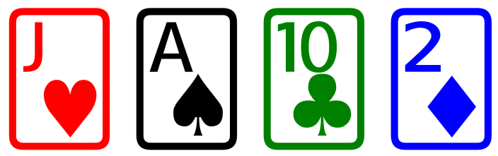
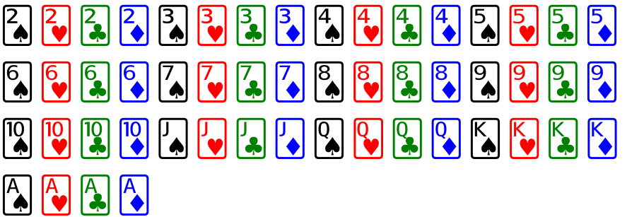
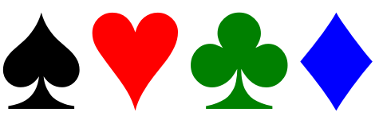
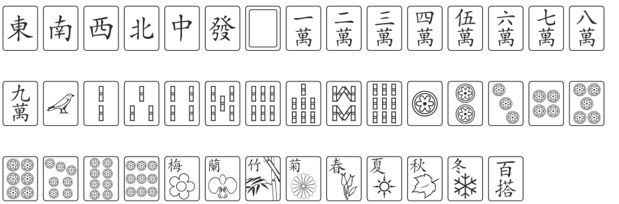

<!-- README.md is generated from README.Rmd. Please edit that file -->

```{r setup, include = FALSE}
knitr::opts_chunk$set(
  collapse = TRUE,
  comment = "#>",
  fig.path = "man/figures/README-",
  out.width = "100%"
)
```

# suitr 

 [](https://codecov.io/github/GregorDeCillia/suitr?branch=master)
 [](https://travis-ci.org/GregorDeCillia/suitr)
 [](https://ci.appveyor.com/project/GregorDeCillia/suitr)
 
This package makes it easy to create cards in R either for printing in the console or for html export. The logic is based aroud the unicode representation
of cards (and other objects) which are wrapped in a span container.

## Installation

You can install suitr from github via `install_github()`

``` r
devtools::install_github("GregorDeCillia/suitr")
```

## Cards

Cards are always represented by strings like `"Kc"` or `"7s"`. They
can be converted into HTML via `card_html()`.

```{r example, results='hide'}
library(suitr)
span(card_html("Jh"), card_html("As"), card_html("Tc"), card_html("2d"))
```



`card_unicode()` converts cards into a unicode representation which means they can be printed directly into the console.

```{r}
cat(card_unicode("Ad"))
```

suitr uses a four color deck by default. This behavior can be changed with
the parameter `four_color`.

```{r}
card_list()
```

```{r, results="hide"}
card_list() %>% lapply(card_html, size = 50) %>% span()
```



```{r, results = "hide"}
card_list() %>% lapply(card_html, size = 50, four_color = FALSE) %>% span()
```


## Suits

It is also possible to get the unicode representation of the suits symbols
and export them into html.

```{r}
suit_list()
```

```{r, results='hide'}
suit_list() %>% lapply(suit_html) %>% span()
```



```{r, results='hide'}
suit_list() %>% lapply(suit_html, fill = FALSE) %>% span()
```


```{r}
suit_list() %>% sapply(suit_unicode) %>% cat()
```

## Special cards

Tere are currently `r length(card_specials())` "special" cards implemented which
do not match the rank-suit pattern of the cards above. Those are wrapped into 
a named list which can be obtained with `card_specials()`.

```{r, results='hide'}
names(card_specials())
card_specials() %>% lapply(unicode_html, style = "color: blue;") %>% span()
```


## Dice

```{r, results='hide'}
1:6 %>% lapply(dice_html, size = 140) %>% span()
```


## Chess

```{r}
pieces_list()
```

```{r, results='hide'}
pieces_list() %>% lapply(chess_html, size = 140) %>% span()
```


```{r, results='hide'}
pieces_list() %>% lapply(chess_html, color = "black", size = 140) %>% span()
```


## Mahjong

```{r}
mahjong_list()[1:4]
```

```{r, results='hide'}
mahjong_list() %>% lapply(mahjong_html, size = 68) %>% span()
```



## Domino

```{r, results='hide'}
span(domino_html(4, 5), domino_html(0, 6), domino_html(6, 2, horizontal = FALSE))
```


## Draughts

```{r}
span(draughts_html("white", "man"), draughts_html("white", "king"),
     draughts_html("black", "man"), draughts_html("black", "king")) %>% browsable()
```

